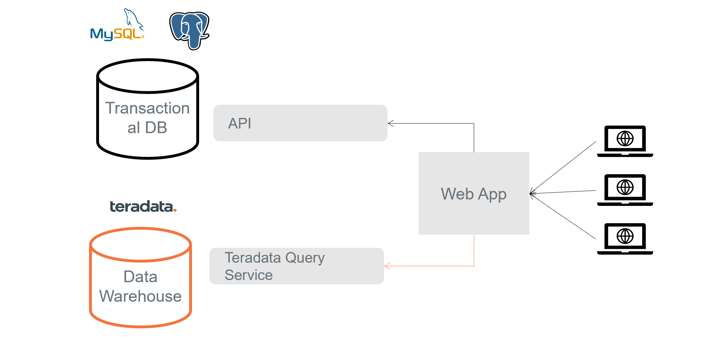

# Introduction

This project showcases the utilization of Teradata Query Service to efficiently retrieve data from a Teradata Vantage Instance within a WebApp.

## What is Teradata Query Service

[Teradata Query Service](https://docs.teradata.com/r/Teradata-Query-Service-Installation-Configuration-and-Usage-Guide-for-Customers/April-2022/Overview/Teradata-Query-Service) is a middleware that provides a REST API that allows the execution of standard SQL statements against a Teradata Vantage instance without managing client-side drivers.

Queries can be executed from web pages, mobile devices, or scripting language using HTTP as the wire protocol and JSON as the data interchange format. 

Query Service provides APIs for:

*   Configure Teradata-supported systems
*   Submit SQL queries and access responses
*   Create database sessions
*   Access database and object metadata

## Use Cases

Query Service is a suitable tool in cases when working with a Teradata driver is not practical or feasible.

Examples:
* A web or mobile application that communicates with services that expose their own APIs. 
	* This projects illustrates this specific use case.
* Working with Low Code tools that allow HTTP calls but not the installation of libraries.
* Execution of SQL Queries from the browser.
	* Teradata web-based SQL editors 

## About the Project - Teddy Retailers Web Application
### Context
As mentioned, this project illustrates the first use case mentioned above. Teddy Retailers is a retailer of common household items.
Teddy Retailers Web Application connects to services that manage it's inventory (ERP system) through an specific endpoint. A recent request has been made to introduce a new marketing strategy aimed at rewarding frequent customers through a discount program.

A frequent customer is defined as a customer with a total lifetime value above a certain threshold and that has ordered from Teddy Retailers in the 
last 200 days.

The discount percentage varies according to Customer Lifetime Value as follows:
- 10% to customers with a Customer Lifetime Value >= 1500 USD
-  5% to customers with a Customer Lifetime Value < 1500 USD and >= 1000 USD

A query to Teradata Data Warehouse is needed to determine the Customer Lifetime Value and the date of the most recent order placed by a specific customer. We leverage Teradata Query Service to quickly set an endpoint that will allow the execution of this query with minimum overhead.

### Implementation

<div align="center">



</div>

- A Flask based web application that queries the Teradata database using Teradata Query Service.
- Order data and price information is mocked through a service that displays mocked data from a JSON file. This endpoint is queried from the frontend.
- Mock data regarding Customer Lifetime Value is loaded to a Teradata Vantage Instance from Object Storage in Google Cloud.
- Query Service is the base of a service to query the Teradata Vantage Instance for Customer Lifetime Value data.

## Prerequisites

- Code IDE
- [Python 3.7 minimum] (https://www.python.org/downloads/)
- [ClearScape Analytics Experience Account] (https://clearscape.teradata.com/sign-in?utm_source=developer_website&utm_medium=github_repository&utm_campaign=query-service)

## Steps for running the project

### Step 1: ClearScape Setup

Sign in to your [ClearScape Analytics Experience account](https://clearscape.teradata.com/sign-in) to create and access database with Query Service.  

<div align="center">


</div>

Once you have signed in, click on **CREATE ENVIRONMENT**

<div align="center">


</div>

Then, you need to provide -
* An _environment name_

  * A contextual name like 'Demo'       

* A _Database password_

  * A password of your choice
  * >Note it down for using it later in the code

* _Region_

  * Select one from the dropdown

<div align="center">


</div>

It will open a new page showing your environment in Teradata Vantage on ClearScape Analytics Experience.

<div align="center">


</div>

Congratulations you are all set to work with Teradata Query Service!


### Step 2: Create .env file

After you have cloned the project, create `.env` file inside it.

<div align="center" style="width:200px; height:200px">


</div>

For connecting with the created ClearScape Analytics Experience environment, we need to provide -
* Host URL,
* User name, and
* Database password

Copy the _Host_ and _Username_ from the Step 1 and _Password_ is the database password we provided when created the environment.

Your .env file will look like this -

``` bash
# Environment Values
TD_HOST='HOST' # Host URL
TD_USER='demo_user' # default user name
TD_PASSWORD='DATABASE_PASSWORD' # your database pasword
```

> Replace **HOST** and **DATABASE_PASSWORD** with your values

### Step 3: Load Mock Data to Teradata Vantage Instance

The most important step is to upload the sample data to the environment.

Run the query below in a database client properly connected to your Teradata Vantage instance.

``` sql
CREATE DATABASE teddy_retailers_warehouse
AS PERMANENT = 110e6;
CREATE TABLE teddy_retailers_warehouse.customers_tvl AS
	(
		SELECT CAST(customer_id as CHAR(5)) as customer_id, email, bought_items, tlv, last_ordered  FROM 
		(
	    	LOCATION='/gs/storage.googleapis.com/clearscape_analytics_demo_data/DEMO_dbtAdvanced/customers_tlv.csv'
		) as d
)  WITH DATA;
```
The `customer_tlv.csv` file has following information -
* _customer_id_
* _email_
* _bought_items_
* _tlv_
* _last_ordered_

The CSV data is used here to calculate discount for customers based on their previous orders. It mocks data already ingested from relevant source systems and transformed in the Data Warehouse. <br>

> The [`orders.json`](/mock_data/orders.json) file contains product details and serves as the basis to generate customer current order.


### Step 4: Python virtual environment and requirements

Create a [Python virtual environment](https://docs.python.org/3/library/venv.html) and install the dependencies required for this project -


``` bash
$ pip install -r requirements.txt
```

You have everything required to run this project on your local machine.

### Step 5: Run the Project

The project is based on Flask, a micro web framework written in Python. <br>

Copy and paste below command to run the project -

``` bash
 flask --app .\teddy_qs.py run
 ```
Copy the address, http://127.0.0.1:5000 and paste it in your browser

 <div align="center">


</div>

The browser should show "Teddy Retailers - Your Order" page. You can click on `Select a Customer` and get the information of different customers.

 <div align="center">


</div>
